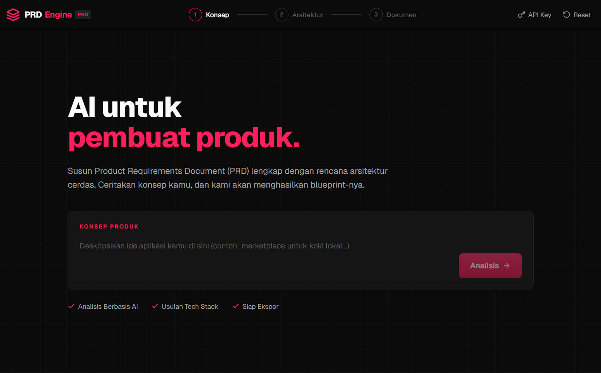
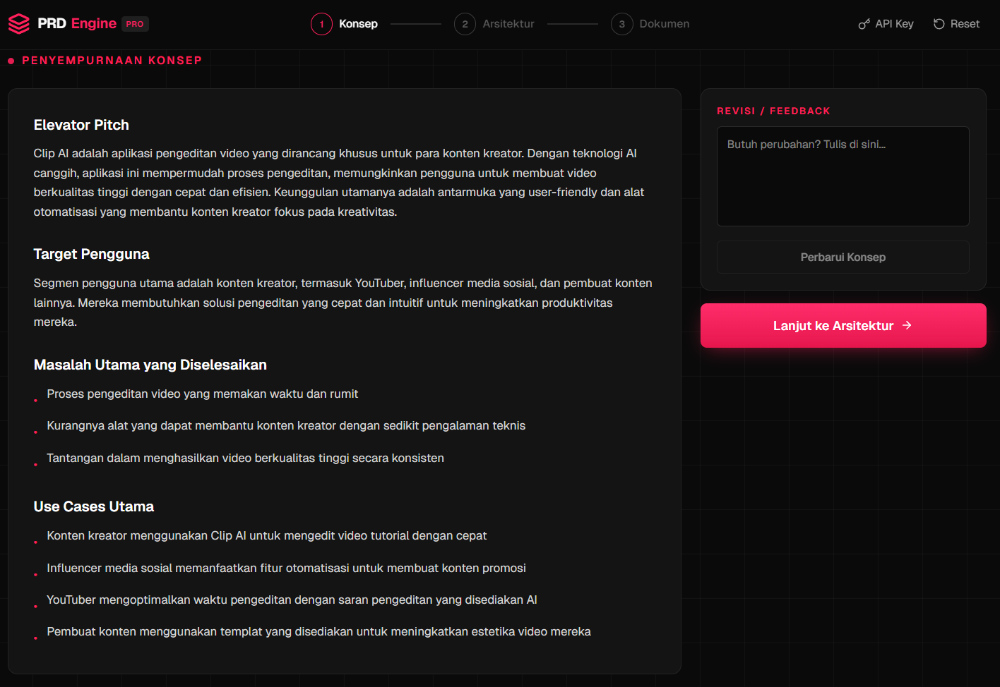
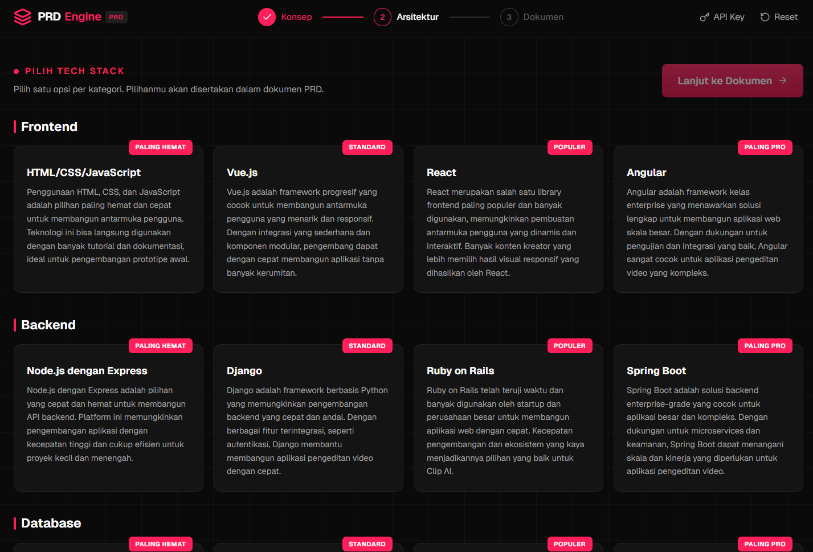
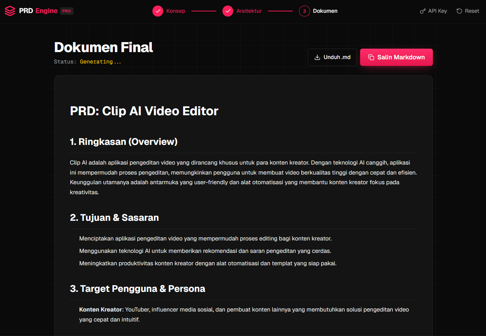

<div align="center">

# PRD Engine Pro

**AI untuk pembuat produk.**
Generator Product Requirements Document (PRD) 3-langkah dengan perencanaan arsitektur cerdas, ditenagai OpenRouter.



</div>

---

## ✨ Fitur

- **Alur 3-langkah terpandu** — `Konsep → Arsitektur → Dokumen`, lengkap dengan stepper, loading states bertema, dan indikator streaming.
- **Analisis konsep cerdas** — AI memecah ide kamu jadi *elevator pitch*, target pengguna, masalah utama, dan use case; bisa direvisi lewat feedback tanpa mulai ulang.
- **Pemilih tech stack interaktif** — 4 kategori (Frontend, Backend, Database, Deployment) × 4 tier (`PALING HEMAT`, `STANDARD`, `POPULER`, `PALING PRO`) yang digenerate kontekstual sesuai konsep produk.
- **Generator PRD streaming** — dokumen Markdown lengkap (14 seksi: Overview, Tujuan, Persona, Fitur, Arsitektur, Skema Data, API, KPI, Risiko, Roadmap, dll.) yang mengalir real-time.
- **BYOK OpenRouter** — pakai API key sendiri, tersimpan hanya di `localStorage` browser. Model selector live-fetch dari OpenRouter dengan info pricing & context length, + badge `GRATIS` untuk model `:free`.
- **Ekspor siap pakai** — salin Markdown atau unduh `.md` langsung.
- **UI Bahasa Indonesia** — semua label, copy, dan prompt AI dalam Bahasa Indonesia.

---

## 📸 Screenshots

<table>
  <tr>
    <td width="50%"></td>
    <td width="50%"></td>
  </tr>
  <tr>
    <td align="center"><sub><b>1.</b> Landing — input konsep</sub></td>
    <td align="center"><sub><b>2.</b> Refinement konsep + panel feedback</sub></td>
  </tr>
  <tr>
    <td width="50%"></td>
    <td width="50%"></td>
  </tr>
  <tr>
    <td align="center"><sub><b>3.</b> Pemilih tech stack interaktif</sub></td>
    <td align="center"><sub><b>4.</b> PRD final (Markdown streaming)</sub></td>
  </tr>
</table>

---

## 🧱 Tech Stack

- **Next.js 16** (App Router, Turbopack) + **React 19** + **TypeScript**
- **TailwindCSS v4** + **shadcn/ui** (primitif yang dipakai)
- **Lucide Icons**
- **react-markdown** + **remark-gfm**
- **OpenRouter API** (bring your own key) — streaming via SSE

---

## 🚀 Mulai Cepat

```bash
# 1. Install dependencies
npm install

# 2. Jalankan dev server
npm run dev
```

Buka [http://localhost:3000](http://localhost:3000) — modal konfigurasi API akan muncul otomatis saat pertama kali.

### Dapatkan OpenRouter API Key

1. Kunjungi [openrouter.ai/keys](https://openrouter.ai/keys) dan buat key (format `sk-or-v1-...`).
2. Paste di modal **Konfigurasi API** di web.
3. Pilih model — direkomendasikan `google/gemini-2.0-flash-exp:free` untuk mulai tanpa biaya.

> Key **tidak pernah** dikirim ke server lain selain OpenRouter. Disimpan hanya di `localStorage` browser kamu.

---

## 🗂️ Struktur Proyek

```
app/
  page.tsx                            # State machine 7-step + wiring semua komponen
  layout.tsx                          # Root layout (dark mode default)
  globals.css                         # Theme, grid-bg, prd-prose markdown styling
  api/
    analyze-concept/route.ts          # Analisis + revisi konsep (JSON)
    generate-architecture/route.ts    # Generate 4 tier × 4 kategori tech stack
    generate-prd/route.ts             # Streaming PRD markdown (SSE → text stream)
    openrouter-models/route.ts        # Proxy daftar model OpenRouter

components/prd/
  Header.tsx                          # Logo + 3-step stepper + Reset + API Key
  ApiKeyModal.tsx                     # BYOK modal (localStorage)
  ModelSelector.tsx                   # Popover searchable model picker
  ConceptStep.tsx                     # Hero + textarea konsep
  ConceptRefinement.tsx               # Hasil analisis + panel revisi
  ArchitectureStep.tsx                # Grid kartu tech stack interaktif
  DocumentStep.tsx                    # Render PRD Markdown + salin/unduh
  LoadingScreen.tsx                   # 4 varian (concept/architecture/research/compile)

lib/
  openrouter.ts                       # Fetch wrapper + JSON parser
  types.ts                            # Types + konstanta label
```

---

## 🔌 API Routes

| Route | Method | Deskripsi |
|-------|--------|-----------|
| `/api/analyze-concept` | `POST` | Analisis konsep + revisi berbasis feedback. Mengembalikan JSON `{ elevatorPitch, targetUser, keyProblems[], useCases[] }`. |
| `/api/generate-architecture` | `POST` | Generate rekomendasi tech stack 4 tier untuk 4 kategori. |
| `/api/generate-prd` | `POST` | Streaming Markdown PRD lengkap (14 seksi) — response `text/plain` chunked. |
| `/api/openrouter-models` | `GET` | Proxy daftar model dari OpenRouter (dengan cache 1 jam) agar key user tidak dipakai untuk listing. |

Payload rute AI selalu butuh `{ apiKey, model, ... }` dari client.

---

## 🛠️ Scripts

```bash
npm run dev        # Dev server (Turbopack)
npm run build      # Production build
npm run start      # Jalankan build hasil
npm run lint       # ESLint
npm run typecheck  # tsc --noEmit
npm run format     # Prettier
```

---

## 🔒 Privasi

- API key **hanya** disimpan di `localStorage` browser kamu.
- Request AI diteruskan dari API route Next.js → OpenRouter. Tidak ada logging payload ke third-party.
- Jalankan sendiri (self-host) kalau butuh kontrol penuh.

---

## 📄 Lisensi

MIT.

